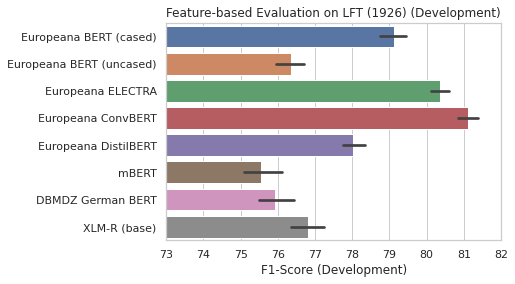
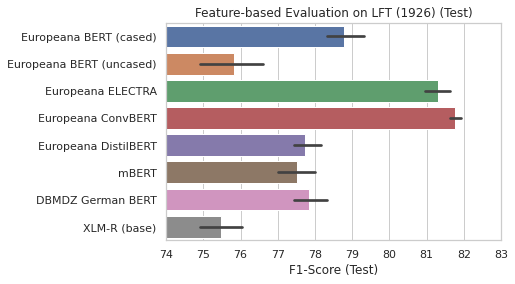
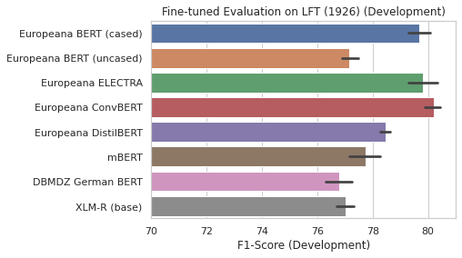
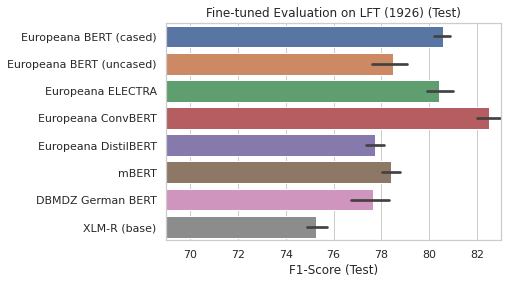
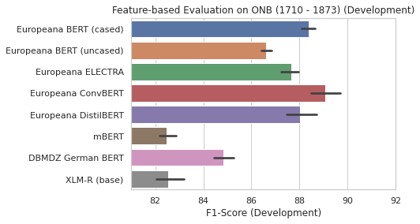
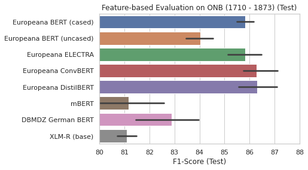
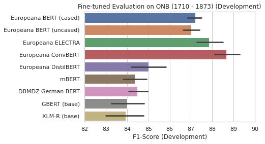
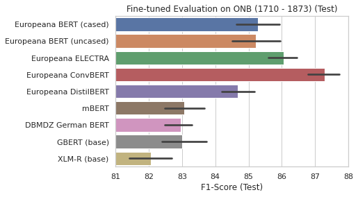

# Europeana BERT and ELECTRA models

[](https://doi.org/10.5281/zenodo.4275044)

In this repository we open source BERT and ELECTRA models trained on various Europeana newspapers.

Notice: We use the open source [Europeana newspapers](http://www.europeana-newspapers.eu/)
that were provided by *The European Library*. However, *The European Library* was permanently
shut down (end of 2019) and thus all direct download links are no longer working.
We are working on providing an alternative download mirror.

# Changelog

* 14.12.2021: Re-Evaluation of fine-tunes models (full hyper-parameter search)
* 25.07.2021: Add fine-tuned evaluations results for various models
* 06.02.2021: Public release of German Europeana DistilBERT and ConvBERT models
* 16.11.2020: Public release of French Europeana BERT and ELECTRA models
* 26.07.2020: Public release of German Europeana ELECTRA model
* 10.02.2020: Initial version of this repo

# Model types

We trained different models, that are described in more detail in the following papers:

* [BERT: Pre-training of Deep Bidirectional Transformers for Language Understanding](https://arxiv.org/abs/1810.04805)
* [ELECTRA: Pre-training Text Encoders as Discriminators Rather Than Generators](https://arxiv.org/abs/2003.10555)
* [ConvBERT: Improving BERT with Span-based Dynamic Convolution](https://arxiv.org/abs/2008.02496)
* [DistilBERT, a distilled version of BERT: smaller, faster, cheaper and lighter](https://arxiv.org/abs/1910.01108)

# German Europeana newspapers

We extracted all German texts using the `language` metadata attribute from the Europeana corpus.

## Stats

The resulting corpus has a size of 51GB and consists of 8,035,986,369 tokens.

Based on the metadata information, texts from the 18th - 20th century are mainly included in the
training corpus. The following figure shows a detailed overview (tokens per year):


## Pretraining

We use the awesome 🤗 / Tokenizers library for building the BERT-compatible vocab (32,000 subwords).

We use the same preprocessing steps and training parameters as for our Turkish BERT and ELECTRA models.
A cheatsheet for can be found [here for BERT](https://github.com/stefan-it/turkish-bert/blob/master/CHEATSHEET.md),
and [here for ELECTRA](https://github.com/stefan-it/turkish-bert/blob/master/electra/CHEATSHEET.md).

The ConvBERT model was trained with the [reference implementation](https://github.com/yitu-opensource/ConvBert)
on a v3-8 TPU with a maximum sequence length of 512 over the complete training corpus for 1M steps.

For the DistilBERT model, only 6GB of the original training data (51GB) was used. The model was trained for
two epochs with the [reference implementation](https://github.com/huggingface/transformers/tree/master/examples/research_projects/distillation)
from Transformers on 4 RTX 3090 with a batch size of 6.

## Results

We mainly compare our models against the NER dataset, that is used in the following
two papers:

* [A Named Entity Recognition Shootout for German](https://www.aclweb.org/anthology/P18-2020/)
  by Riedl and Padó
* [Towards Robust Named Entity Recognition for Historic German](https://www.aclweb.org/anthology/W19-4312/)
  by Schweter and Baiter

The datasets used in these papers are: ONB (Austrian National Library) and LFT (Dr Friedrich Teman Library).
LFT corpus consists of texts from 1926, ONB corpus consists of texts ranging from 1710 - 1873.

We include various other BERT models (incl. XLM-R) in our comparison. Note: Schweter and Baiter used Flair
Embeddings (stacked with Word Embeddings) resulting in the current SOTA for these tasks.

We use the awesome Flair library for experiments with our Transformer-based models.
It nicely wraps the outstanding 🤗 Transformers library and we can also use the
HuggingFace model hub. 

We evaluate both feature-based and fine-tuned NER models. For the feature-based approach we use the mean over all layers from the
Transformer model. We use an initial learning rate of 0.1. Then we reduce the learning rate by a factor of 0.5 with a patience of
3. This factor determines the number of epochs with no improvement after which learning rate will be reduced. We use a batch size of 16
for training feature-based models and use different seeds for training 5 models. Averaged F1-score is then calculated.

For the fine-tuned models we perform a hyper-parameter search over:

* Batch Sizes: `[8, 16]`
* Number of Epochs: `[5, 10]`
* Learning Rates: `[1e-5, 3e-5, 5e-5]`

Then we choose the best hyper-parameter configuration and train 5 models with different seeds and average F1-score over these models.

For training our feature-based NER models we use the `flair-ner-trainer.py` script and `flair-ner-predictor.py`
for predicting and piping the output to the CoNLL-2003 evaluation script. We use `flair-ner-trainer-ft.py` for fine-tuning, with all
necessary configuration files located in the `configs` folder of this repository.

Please star and watch [Flair](https://github.com/flairNLP/flair) and [Transformers](https://github.com/huggingface/transformers)
on GitHub!

### LFT (1926)

#### Feature-based evaluation

| Model                    | Development F1-score | Test F1-score
| ------------------------ | -------------------- | -----------------
| DBMDZ German BERT        | 75.926 ± 0.57        | 77.852 ± 0.60
| Europeana BERT (cased)   | 79.118 ± 0.42        | 78.782 ± 0.70
| Europeana BERT (uncased) | 76.350 ± 0.49        | 75.824 ± 1.13
| Europeana ConvBERT       | **81.114** ± 0.33    | **81.756** ± 0.19
| Europeana DistilBERT     | 78.010 ± 0.38        | 77.728 ± 0.51
| Europeana ELECTRA        | 80.370 ± 0.29        | 81.294 ± 0.42
| XLM-R (base)             | 76.814 ± 0.58        | 75.472 ± 0.72
| mBERT (cased)            | 75.548 ± 0.69        | 77.506 ± 0.63




#### Fine-tuned evaluation

| Model                    | Development F1-score | Test F1-score
| ------------------------ | -------------------- | -----------------
| DBMDZ German BERT        | 76.786 ± 0.61        | 77.654 ± 0.99
| Europeana BERT (cased)   | 79.682 ± 0.52        | 80.568 ± 0.45
| Europeana BERT (uncased) | 77.170 ± 0.40        | 78.474 ± 0.96
| Europeana ConvBERT       | **80.212** ± 0.35    | **82.488** ± 0.70
| Europeana DistilBERT     | 78.458 ± 0.24        | 77.732 ± 0.49
| Europeana ELECTRA        | 79.830 ± 0.70        | 80.392 ± 0.68
| XLM-R (base)             | 77.022 ± 0.40        | 75.274 ± 0.54
| mBERT (cased)            | 77.742 ± 0.76        | 78.402 ± 0.52




The current SOTA reported by Schweter and Baiter is 77.51% on test set.

### ONB (1710 - 1873)

#### Feature-based evaluation

| Model                    | Development F1-score | Test F1-score
| ------------------------ | -------------------- | -----------------
| DBMDZ German BERT        | 84.846 ± 0.57        | 82.888 ± 1.54
| Europeana BERT (cased)   | 88.396 ± 0.38        | 85.824 ± 0.43
| Europeana BERT (uncased) | 86.628 ± 0.28        | 84.042 ± 0.72
| Europeana ConvBERT       | **89.072** ± 0.83    | 86.274 ± 0.92
| Europeana DistilBERT     | 88.018 ± 0.77        | **86.294** ± 1.00
| Europeana ELECTRA        | 87.670 ± 0.48        | 85.832 ± 0.85
| XLM-R (base)             | 82.550 ± 0.73        | 81.100 ± 0.49
| mBERT (cased)            | 82.480 ± 0.46        | 81.164 ± 2.19




#### Fine-tunes evaluation

| Model                    | Development F1-score | Test F1-score
| ------------------------ | -------------------- | -----------------
| DBMDZ German BERT        | 85.378 ± 0.59        | 83.510 ± 0.73
| Europeana BERT (cased)   | 88.766 ± 1.10        | 85.730 ± 0.96
| Europeana BERT (uncased) | 87.196 ± 0.44        | 85.462 ± 1.11
| Europeana ConvBERT       | **88.998** ± 0.88    | **86.634** ± 1.07
| Europeana DistilBERT     | 86.172 ± 0.49        | 85.712 ± 0.94
| Europeana ELECTRA        | 88.236 ± 0.89        | 86.362 ± 1.04
| XLM-R (base)             | 84.010 ± 0.29        | 81.532 ± 1.36
| mBERT (cased)            | 84.416 ± 0.73        | 82.530 ± 1.63




The current SOTA reported by Schweter and Baiter is 85.31% on test set.

Notice: The ONB dataset covers texts from 1710 - 1873. The Europeana training dataset only contains little data for this specific
time period. We are currently working on BERT models with other training data for this period!

## Model weights

Most of the pre-trained models are located on the 🤗 / model hub:

* [German Europeana BERT (base, cased)](https://huggingface.co/dbmdz/bert-base-german-europeana-cased)
* [German Europeana BERT (base, uncased)](https://huggingface.co/dbmdz/bert-base-german-europeana-uncased)
* [German Europeana ELECTRA (base, cased, discriminator)](https://huggingface.co/dbmdz/electra-base-german-europeana-cased-discriminator)
* [German Europeana ELECTRA (base, cased, generator)](https://huggingface.co/dbmdz/electra-base-german-europeana-cased-generator)
* [German Europeana ConvBERT (base. cased)](https://huggingface.co/dbmdz/convbert-base-german-europeana-cased)
* [German Europeana DistilBERT (base, cased)](https://huggingface.co/dbmdz/distilbert-base-german-europeana-cased)

# French Europeana newspapers

We also extracted all French texts using the `language` metadata attribute from the Europeana corpus.

## Stats

The resulting corpus has a size of 63GB and consists of 11,052,528,456 tokens.

Based on the metadata information, texts from the 18th - 20th century are mainly included in the
training corpus. The following figure shows a detailed overview (tokens per year):


## Pretraining

We use the awesome 🤗 / Tokenizers library for building the BERT-compatible vocab (32,000 subwords).

We use the same preprocessing steps and training parameters as for our Turkish BERT and ELECTRA models.
A cheatsheet for can be found [here for BERT](https://github.com/stefan-it/turkish-bert/blob/master/CHEATSHEET.md),
and [here for ELECTRA](https://github.com/stefan-it/turkish-bert/blob/master/electra/CHEATSHEET.md).

## Model weights

Both BERT and ELECTRA model weights for PyTorch and TensorFlow are available.

* French Europeana BERT: `dbmdz/bert-base-french-europeana-cased` - [model hub page](https://huggingface.co/dbmdz/bert-base-french-europeana-cased/tree/main)
* French Europeana ELECTRA (discriminator): `dbmdz/electra-base-french-europeana-cased-discriminator` - [model hub page](https://huggingface.co/dbmdz/electra-base-french-europeana-cased-discriminator/tree/main)
* French Europeana ELECTRA (generator): `dbmdz/electra-base-french-europeana-cased-generator` - [model hub page](https://huggingface.co/dbmdz/electra-base-french-europeana-cased-generator/tree/main)

# License

All models are licensed under [MIT](LICENSE).

# Huggingface model hub

All models are available on the [Huggingface model hub](https://huggingface.co/dbmdz).

# Contact (Bugs, Feedback, Contribution and more)

For questions about our Europeana BERT, ELECTRA and ConvBERT models just open a new discussion
[here](https://github.com/stefan-it/europeana-bert/discussions) 🤗

# Citation

You can use the following BibTeX entry for citation:

```bibtex
@software{stefan_schweter_2020_4275044,
  author       = {Stefan Schweter},
  title        = {Europeana BERT and ELECTRA models},
  month        = nov,
  year         = 2020,
  publisher    = {Zenodo},
  version      = {1.0.0},
  doi          = {10.5281/zenodo.4275044},
  url          = {https://doi.org/10.5281/zenodo.4275044}
}
```

# Acknowledgments

Research supported with Cloud TPUs from Google's TensorFlow Research Cloud (TFRC).
Thanks for providing access to the TFRC ❤️

Thanks to the generous support from the [Hugging Face](https://huggingface.co/) team,
it is possible to download both cased and uncased models from their S3 storage 🤗
